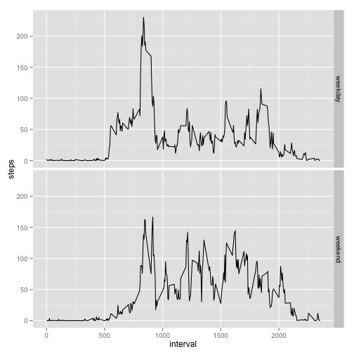

### Loading and preprocessing the data


```r
library(lubridate)
unzip("activity.zip")
data <- read.csv("activity.csv", stringsAsFactors = FALSE)
data$date <- ymd(data$date)
```

### What is mean total number of steps taken per day?

I calculate the total number of steps taken per day


```r
library(xtable)
library(dplyr)
total <- data %>% group_by(date) %>% summarise(sum(steps, na.rm = TRUE))
names(total)[2] <- "steps.per.day"
total$date <- as.character(total$date)
xt <- xtable(total)
print(xt, type = "html")
```

<!-- html table generated in R 3.1.2 by xtable 1.7-4 package -->
<!-- Sun Apr 19 21:56:14 2015 -->
<table border=1>
<tr> <th>  </th> <th> date </th> <th> steps.per.day </th>  </tr>
  <tr> <td align="right"> 1 </td> <td> 2012-10-01 </td> <td align="right">   0 </td> </tr>
  <tr> <td align="right"> 2 </td> <td> 2012-10-02 </td> <td align="right"> 126 </td> </tr>
  <tr> <td align="right"> 3 </td> <td> 2012-10-03 </td> <td align="right"> 11352 </td> </tr>
  <tr> <td align="right"> 4 </td> <td> 2012-10-04 </td> <td align="right"> 12116 </td> </tr>
  <tr> <td align="right"> 5 </td> <td> 2012-10-05 </td> <td align="right"> 13294 </td> </tr>
  <tr> <td align="right"> 6 </td> <td> 2012-10-06 </td> <td align="right"> 15420 </td> </tr>
  <tr> <td align="right"> 7 </td> <td> 2012-10-07 </td> <td align="right"> 11015 </td> </tr>
  <tr> <td align="right"> 8 </td> <td> 2012-10-08 </td> <td align="right">   0 </td> </tr>
  <tr> <td align="right"> 9 </td> <td> 2012-10-09 </td> <td align="right"> 12811 </td> </tr>
  <tr> <td align="right"> 10 </td> <td> 2012-10-10 </td> <td align="right"> 9900 </td> </tr>
  <tr> <td align="right"> 11 </td> <td> 2012-10-11 </td> <td align="right"> 10304 </td> </tr>
  <tr> <td align="right"> 12 </td> <td> 2012-10-12 </td> <td align="right"> 17382 </td> </tr>
  <tr> <td align="right"> 13 </td> <td> 2012-10-13 </td> <td align="right"> 12426 </td> </tr>
  <tr> <td align="right"> 14 </td> <td> 2012-10-14 </td> <td align="right"> 15098 </td> </tr>
  <tr> <td align="right"> 15 </td> <td> 2012-10-15 </td> <td align="right"> 10139 </td> </tr>
  <tr> <td align="right"> 16 </td> <td> 2012-10-16 </td> <td align="right"> 15084 </td> </tr>
  <tr> <td align="right"> 17 </td> <td> 2012-10-17 </td> <td align="right"> 13452 </td> </tr>
  <tr> <td align="right"> 18 </td> <td> 2012-10-18 </td> <td align="right"> 10056 </td> </tr>
  <tr> <td align="right"> 19 </td> <td> 2012-10-19 </td> <td align="right"> 11829 </td> </tr>
  <tr> <td align="right"> 20 </td> <td> 2012-10-20 </td> <td align="right"> 10395 </td> </tr>
  <tr> <td align="right"> 21 </td> <td> 2012-10-21 </td> <td align="right"> 8821 </td> </tr>
  <tr> <td align="right"> 22 </td> <td> 2012-10-22 </td> <td align="right"> 13460 </td> </tr>
  <tr> <td align="right"> 23 </td> <td> 2012-10-23 </td> <td align="right"> 8918 </td> </tr>
  <tr> <td align="right"> 24 </td> <td> 2012-10-24 </td> <td align="right"> 8355 </td> </tr>
  <tr> <td align="right"> 25 </td> <td> 2012-10-25 </td> <td align="right"> 2492 </td> </tr>
  <tr> <td align="right"> 26 </td> <td> 2012-10-26 </td> <td align="right"> 6778 </td> </tr>
  <tr> <td align="right"> 27 </td> <td> 2012-10-27 </td> <td align="right"> 10119 </td> </tr>
  <tr> <td align="right"> 28 </td> <td> 2012-10-28 </td> <td align="right"> 11458 </td> </tr>
  <tr> <td align="right"> 29 </td> <td> 2012-10-29 </td> <td align="right"> 5018 </td> </tr>
  <tr> <td align="right"> 30 </td> <td> 2012-10-30 </td> <td align="right"> 9819 </td> </tr>
  <tr> <td align="right"> 31 </td> <td> 2012-10-31 </td> <td align="right"> 15414 </td> </tr>
  <tr> <td align="right"> 32 </td> <td> 2012-11-01 </td> <td align="right">   0 </td> </tr>
  <tr> <td align="right"> 33 </td> <td> 2012-11-02 </td> <td align="right"> 10600 </td> </tr>
  <tr> <td align="right"> 34 </td> <td> 2012-11-03 </td> <td align="right"> 10571 </td> </tr>
  <tr> <td align="right"> 35 </td> <td> 2012-11-04 </td> <td align="right">   0 </td> </tr>
  <tr> <td align="right"> 36 </td> <td> 2012-11-05 </td> <td align="right"> 10439 </td> </tr>
  <tr> <td align="right"> 37 </td> <td> 2012-11-06 </td> <td align="right"> 8334 </td> </tr>
  <tr> <td align="right"> 38 </td> <td> 2012-11-07 </td> <td align="right"> 12883 </td> </tr>
  <tr> <td align="right"> 39 </td> <td> 2012-11-08 </td> <td align="right"> 3219 </td> </tr>
  <tr> <td align="right"> 40 </td> <td> 2012-11-09 </td> <td align="right">   0 </td> </tr>
  <tr> <td align="right"> 41 </td> <td> 2012-11-10 </td> <td align="right">   0 </td> </tr>
  <tr> <td align="right"> 42 </td> <td> 2012-11-11 </td> <td align="right"> 12608 </td> </tr>
  <tr> <td align="right"> 43 </td> <td> 2012-11-12 </td> <td align="right"> 10765 </td> </tr>
  <tr> <td align="right"> 44 </td> <td> 2012-11-13 </td> <td align="right"> 7336 </td> </tr>
  <tr> <td align="right"> 45 </td> <td> 2012-11-14 </td> <td align="right">   0 </td> </tr>
  <tr> <td align="right"> 46 </td> <td> 2012-11-15 </td> <td align="right">  41 </td> </tr>
  <tr> <td align="right"> 47 </td> <td> 2012-11-16 </td> <td align="right"> 5441 </td> </tr>
  <tr> <td align="right"> 48 </td> <td> 2012-11-17 </td> <td align="right"> 14339 </td> </tr>
  <tr> <td align="right"> 49 </td> <td> 2012-11-18 </td> <td align="right"> 15110 </td> </tr>
  <tr> <td align="right"> 50 </td> <td> 2012-11-19 </td> <td align="right"> 8841 </td> </tr>
  <tr> <td align="right"> 51 </td> <td> 2012-11-20 </td> <td align="right"> 4472 </td> </tr>
  <tr> <td align="right"> 52 </td> <td> 2012-11-21 </td> <td align="right"> 12787 </td> </tr>
  <tr> <td align="right"> 53 </td> <td> 2012-11-22 </td> <td align="right"> 20427 </td> </tr>
  <tr> <td align="right"> 54 </td> <td> 2012-11-23 </td> <td align="right"> 21194 </td> </tr>
  <tr> <td align="right"> 55 </td> <td> 2012-11-24 </td> <td align="right"> 14478 </td> </tr>
  <tr> <td align="right"> 56 </td> <td> 2012-11-25 </td> <td align="right"> 11834 </td> </tr>
  <tr> <td align="right"> 57 </td> <td> 2012-11-26 </td> <td align="right"> 11162 </td> </tr>
  <tr> <td align="right"> 58 </td> <td> 2012-11-27 </td> <td align="right"> 13646 </td> </tr>
  <tr> <td align="right"> 59 </td> <td> 2012-11-28 </td> <td align="right"> 10183 </td> </tr>
  <tr> <td align="right"> 60 </td> <td> 2012-11-29 </td> <td align="right"> 7047 </td> </tr>
  <tr> <td align="right"> 61 </td> <td> 2012-11-30 </td> <td align="right">   0 </td> </tr>
   </table>

Create a histogram of the total number of steps taken each day. 


```r
hist(total$steps.per.day, xlab = "Steps per day", main = "Total steps")
```

 

Mean of the total number of steps taken per day: 


```r
mean_step <- mean(total$steps.per.day)
mean_step
```

```
## [1] 9354.23
```

Median: 


```r
median_step <- median(total$steps.per.day)
median_step
```

```
## [1] 10395
```

## What is the average daily activity pattern?

A time series plot of the 5-minute interval (x-axis) and the average number of steps taken, averaged across all days (y-axis).


```r
steps_by_interval <- data %>% group_by(interval) %>% summarise(mean(steps, na.rm = TRUE))
names(steps_by_interval)[2] <- "average.steps"
plot(steps_by_interval$interval, steps_by_interval$average.steps, type = "l", xlab = "Interval", ylab = "Average number of steps")
```

 

5-minute interval, on average across all the days in the dataset, contains the maximum number of steps?


```r
maxint <- max(steps_by_interval$average.steps)
number_of_interval <- steps_by_interval %>% filter(average.steps == maxint) 
xt <- xtable(number_of_interval)
print(xt, type = "html")
```

<!-- html table generated in R 3.1.2 by xtable 1.7-4 package -->
<!-- Sun Apr 19 21:56:15 2015 -->
<table border=1>
<tr> <th>  </th> <th> interval </th> <th> average.steps </th>  </tr>
  <tr> <td align="right"> 1 </td> <td align="right"> 835 </td> <td align="right"> 206.17 </td> </tr>
   </table>

## Imputing missing values

Total number of missing values in the dataset


```r
comple <- complete.cases(data)
comple <- comple[comple == FALSE]
length(comple)
```

```
## [1] 2304
```

Fill in all of the missing values for steps in the dataset with the mean for the appropriate 5-minute interval. And create a new data frame with the missing data filled in. Data frame named data1.


```r
data1 <- data
for (i in 1:17568) {if (is.na(data1$steps[i])) {                
        inter <- steps_by_interval %>% filter (interval == data1$interval[i])
                data1$steps[i] <- inter$average.steps }
}
```

Create a histogram of the total number of steps taken each day.


```r
total1 <- data1 %>% group_by(date) %>% summarise(sum(steps, na.rm = TRUE))
names(total1)[2] <- "steps.per.day"

hist(total1$steps.per.day, xlab = "Total steps per day", main = "Total steps after fill in NAs")
```

 

Mean total number of steps taken per day.


```r
mean_step1 <- mean(total1$steps.per.day)
mean_step1
```

```
## [1] 10766.19
```

Median:


```r
median_step1 <- median(total1$steps.per.day)
median_step1
```

```
## [1] 10766.19
```

Do these values differ from the estimates from the first part of the assignment? Yes, they do.

Values without filling NAs:

Mean: 


```r
mean_step <- mean(total$steps.per.day)
mean_step
```

```
## [1] 9354.23
```

Median: 


```r
median_step <- median(total$steps.per.day)
median_step
```

```
## [1] 10395
```

Values after:

Mean: 


```r
mean_step1 <- mean(total1$steps.per.day)
mean_step1
```

```
## [1] 10766.19
```

Median: 


```r
median_step1 <- median(total1$steps.per.day)
median_step1
```

```
## [1] 10766.19
```

## Are there differences in activity patterns between weekdays and weekends?

Create a new factor variable in the dataset with two levels – “weekday” and “weekend” indicating whether a given date is a weekday or weekend day.


```r
library(chron)
weekdays <- is.weekend(data1$date)

data1 <- data1 %>% mutate(weekday = weekdays)
data1$weekday <- as.character(data1$weekday)
data1$weekday <- gsub("FALSE", "weekday", data1$weekday)
data1$weekday <- gsub("TRUE", "weekend", data1$weekday)
data1$weekday <- as.factor(data1$weekday)

steps_by_interval_wday <- data1 %>% group_by(interval, weekday) %>% summarise(mean(steps))
names(steps_by_interval_wday)[3] <- "steps"
```

Create a panel plot containing a time series plot of the 5-minute interval (x-axis) and the average number of steps taken, averaged across all weekday days or weekend days (y-axis).


```r
library(ggplot2)
g <- ggplot(steps_by_interval_wday, aes(interval, steps))
g + 
        geom_line() + 
        facet_grid(weekday ~ .)
```

 
